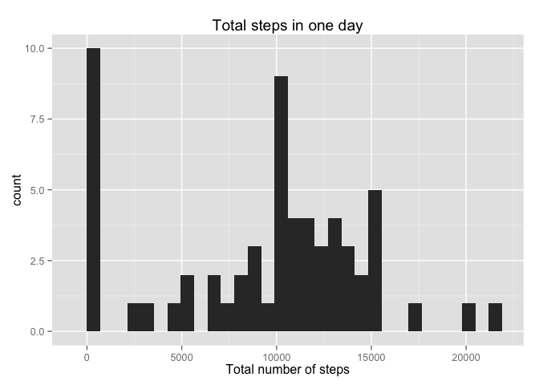
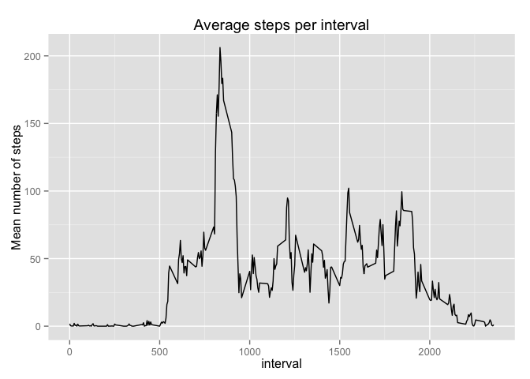
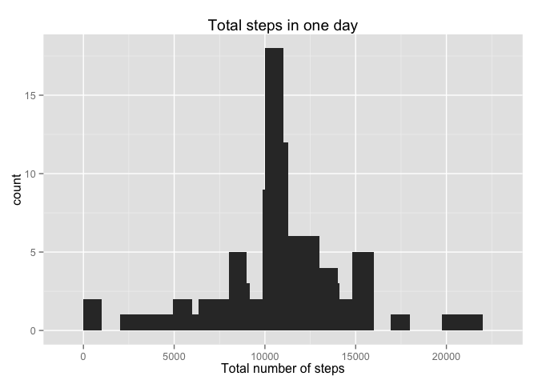
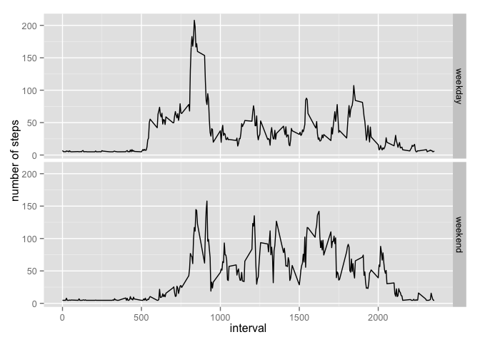

# Reproducible Research: Peer Assessment 1


## Loading libraries


```r
# Load libraries
library(ggplot2)
library(plyr)
```


## Loading and preprocessing the data


```r
# read csv
activity <- read.csv('activity.csv', colClasses=c('integer','Date','integer'))

# summarize activity per interval
stepsPerInterval <- ddply(activity, c('interval'),summarise, meansteps = mean(steps,na.rm=TRUE))

# summarize activity pre day
stepsPerDay <- ddply(activity, c('date'),summarise, totalsteps=sum(steps,na.rm=TRUE))
```


## What is mean total number of steps taken per day?


Mean total number od steps: 9354.2295082.  


```r
histogram_stepsPerDay <- ggplot(stepsPerDay,aes(x=totalsteps)) +
  geom_histogram() +
  xlab('Total number of steps') +
  ggtitle('Total steps in one day')
print(histogram_stepsPerDay)
```

```
## stat_bin: binwidth defaulted to range/30. Use 'binwidth = x' to adjust this.
```

 


## What is the average daily activity pattern?


```r
line_stepsPerInterval <- ggplot(stepsPerInterval, aes(x=interval, y=meansteps)) +
  geom_line() +
  ggtitle('Average steps per interval') +
  ylab('Mean number of steps')
print(line_stepsPerInterval)
```

 


Interval with max number of steps: 835 


## Imputing missing values


Number of NAs: 2304


```r
# count NAs
na <- is.na(activity$steps)

# view NAs overview table
table(na)
```

```
## na
## FALSE  TRUE 
## 15264  2304
```


```r
# Replace all NAs with mean value of 5-minute interval and create new complete data frame.
replace.value <- function(steps, interval) {
    replaced <- NA
    if (!is.na(steps))
        replaced <- c(steps)
    else
        replaced <- mean(activity[activity$interval==activity$interval, 'steps'], na.rm=TRUE)
    return(replaced)
}
activityReplaced <- activity
activityReplaced$steps <- mapply(replace.value, activityReplaced$steps, activityReplaced$interval)
```


```r
# sanity check for NAs in new data frame
table(is.na(activityReplaced$steps))
```

```
## 
## FALSE 
## 17568
```


```r
# calculate sum
activityReplacedSum <- tapply(activityReplaced$steps, activityReplaced$date, FUN=sum)

# plot histogram
histogram_activityReplacedSum <- qplot(activityReplacedSum, binwidth=1000) +
  geom_histogram() +
  xlab('Total number of steps') +
  ggtitle('Total steps in one day')
print(histogram_activityReplacedSum)
```

```
## stat_bin: binwidth defaulted to range/30. Use 'binwidth = x' to adjust this.
```

 


## Are there differences in activity patterns between weekdays and weekends?


Extraction of the weekday and type of day


```r
# append exact weekday for sanity check
activityReplaced$weekday <- weekdays(as.Date(activityReplaced$date))

# define references
weekdaysReference = c('Monday', 'Tuesday', 'Wednesday', 'Thursday', 'Friday')
weekendReference = c('Saturday', 'Sunday')

# function to be called to execute the check
weekday <- function(date) {
  day <- weekdays(date)
  if (day %in% weekdaysReference) 
    return('weekday') 
  else if (day %in% weekendReference) 
    return('weekend') 
  else stop('your mama')
}

# activityReplaced$date <- as.Date(filled.data$date)
activityReplaced$type <- sapply(activityReplaced$date, FUN=weekday)
```


Generate the time series plot.


```r
# calculate averages
averages <- aggregate(steps ~ interval + type, data=activityReplaced, mean)

# print the panel plot
line_dayPattern <- ggplot(averages, aes(interval, steps)) + 
  geom_line() + 
  facet_grid(type ~ .) + 
  xlab('interval') + 
  ylab('number of steps')
print(line_dayPattern)
```

 


